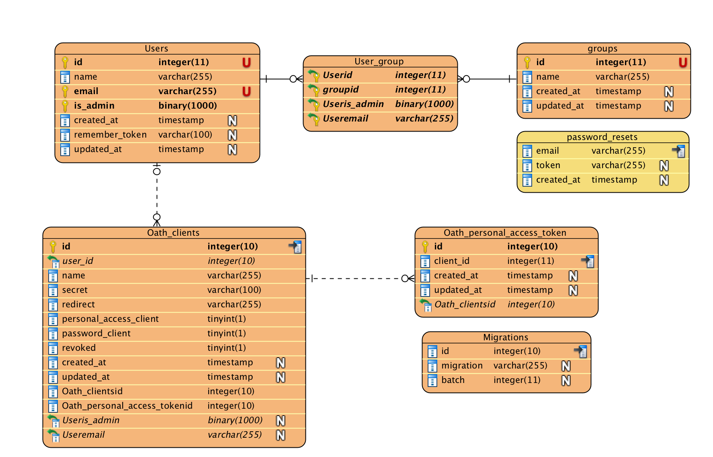

# Intro
This repository is developed according Internation's request. and contains user and group permission within a REST API witch powered by Laravel framework and it's own JWT tokened base Authentication system.

## Data model
The project's data store is based on relational structure, So I choose Mysql for my DBMS and Innodb engine, Which supports indexing, relationship and per row locking system as well.

Let's take a look at blew ER diagram which describe our tiny database structure and relationship between the tables.


## Class Diagram
Here is current project's most important parts class diagram, Notice! this diagram didn't cover all part of the project, The sections are Laravel's built-in classes so it doesn't contains more details.


# How to start the project?
To sett up the project easier you can use the Vagrant based Mysql which provisioned by a Bash script in this project. The default variables are MySQL configuration please take a look at ```Vagrantfile```.

```
Host: 10.19.17.12
Port: 3306
Database: homestead
username: root
password: password
```

## Getting started
1. Clone this repository
2. Copy ```.env.exmaple``` to ```.env```
3. Run ```composer update```
4. Run ```php artisan internations:setup```
5. Run ```php artisan serv``` to serve the project on `127.0.0.1:8000`

Ensure that MySQL is not running on your machine before starting up, as there will be a port conflict. Vagrant will soon tell you :)


The ```php artisan internations:setup``` will start the MySQL vagrant machine and then provisioning the Mysql configuration, Then the migration and data factories will fill the tables and Authentication tokens will generated for supper user.

## Test
There is multiple UnitTests located and configured on ```tests``` directory. These unit tests asserts this project APIs scenarios such as token registration or test the API result data and structure.

You can easily run the test by following blew command.

```
vendor/bin/phpunit
```

### API
This section show you how to send the requests to this api.

### /api/register - Token registration
If you want to access the API you must generate a access key, And every access key is accessible on user creation step.

Please pass the generated token on this step to authorization header with ```Bearer QER@@#...``` format.

Method: `POST`

```
name: test
email: test@test.com
is_admin: 0 //Boolean 0-1
password: !@#F!#FFSFGS#$GSDFG434
```

Result:

Output:
```
{
  "status": "success",
  "token": "EFqewf#@$Gefgsfd...."
}
```

### /api/user - The users list

Header:
* Accept: application/json
* Authorization: Bearer <YOUR_GENERATED_TOKEN>

Method: `GET`
Output:
```
{
'data' => {
  '*' => {
    'id',
    'name',
    'email',
    'groups' => [ '*' => [
      'id',
      'name',
      'created_at',
      'updated_at'
    ]
  }
}}
```

### /api/user/{id} - The user's info

Header:
* Accept: application/json
* Authorization: Bearer <YOUR_GENERATED_TOKEN>

Method: `GET`
Output:
```
{
'data' => {
    'id',
    'name',
    'email',
    'groups' => [ '*' => [
      'id',
      'name',
      'created_at',
      'updated_at'
    ]
  }
}}
```

### /api/user/{id} - Delete the current user

Header:
* Accept: application/json
* Authorization: Bearer <YOUR_GENERATED_TOKEN>

Method: `DELETE`
Output:
```
{
  "status": "success",
  "message": "DeleteUser",
  "description": "The user deleted successfully!"
}
```

### /api/user - Create the new user

Header:
* Accept: application/json
* Authorization: Bearer <YOUR_GENERATED_TOKEN>

Method: `POST`
Output:
```
{
  "status": "success",
  "description": "The User added to list successfully!"
}
```

### /api/group - The group list

Header:
* Accept: application/json
* Authorization: Bearer <YOUR_GENERATED_TOKEN>

Method: `GET`
Output:
```
{
'data' => {
  '*' => {
    'id',
    'name',
    'users' => [ '*' => [
      'id',
      'name',
      'created_at',
      'updated_at'
    ]
  }
}}
```

### /api/group/{id} - The group's info

Header:
* Accept: application/json
* Authorization: Bearer <YOUR_GENERATED_TOKEN>

Method: `GET`
Output:
```
{
'data' => {
    'id',
    'name',
    'users' => [ '*' => [
      'id',
      'name',
      'created_at',
      'updated_at'
    ]
  }
}}
```

### /api/group/{id} - Delete the current group

Header:
* Accept: application/json
* Authorization: Bearer <YOUR_GENERATED_TOKEN>

Method: `DELETE`
Output:
```
{
  "status": "success",
  "message": "DeleteGroup",
  "description": "The group deleted successfully!"
}
```

### /api/group - Create the new group

Header:
* Accept: application/json
* Authorization: Bearer <YOUR_GENERATED_TOKEN>

Method: `POST`
Output:
```
{
  "status": "success",
  "description": "The User added to list successfully!"
}
```
